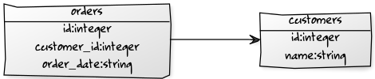

# Texas

A simple ORM (for [paris](https://github.com/emedia-project/paris))

## Install

To use `texas` in you application, just add the following line in your `rebar.config` file :

```
{texas, ".*", {git, "https://github.com/emedia-project/texas", "master"}},
```

## Drivers

You also need a *driver* :

* sqlite : https://github.com/emedia-project/texas_sqlite
* PostgreSQL : https://github.com/emedia-project/texas_pgsql
* MySQL : https://github.com/emedia-project/texas_mysql

## Define table

With `texas` a Table is defined as an Erlang module. The name of the table is the name of the module.

```erlang
-module(my_table).
```

To generate the table, you **must** use the `texas_transform` parser. To do so, just add the following line under the module declaration :

```erlang
-compile([{parse_transform, texas_transform}]).
```

The you define the columns using `-field`. This directive takes a tuple of two elements. The first element is an atom corresponding to the name of the column. The second element is a key list accepting the following options :

* `{type, Type}` where `Type` = `integer`|`string`|`float`|`date`|`time`|`datetime`
* `{autoincrement, Auto}` where `Auto` = `true`|`false` (default: `false`)
* `{len, Size}` where `Size` is a number or a tuple (default: `null`)
* `{not_null, NN}` where `NN` = `true`|`false` (default: `false`)
* `{unique, Uniq}` where `Uniq` = `true`|`false` (default: `false`)
* `{default, Def}` where `Def` = `item()` (default: `null`)

```erlang
-field({id,   [{type, integer}, {autoincrement, true}]}).
-field({name, [{type, string},  {len, 128}           ]}).
```

## Associations

Each table involved in an associations **must have** a column `id` !!!

### has_one


`accounts.erl` :

```erlang
-module(accounts).
-compile([{parse_transform, texas_transform}]).

-field({id,             [{type, integer}, {autoincrement, true}]}).
-field({account_number, [{type, string},  {len, 255}           ]}).
-field({supplier,       [{belongs_to, suppliers}               ]}).
```

`suppliers.erl` :

```erlang
-module(suppliers).
-compile([{parse_transform, texas_transform}]).

-field({id,             [{type, integer}, {autoincrement, true}]}).
-field({name,           [{type, string},  {len, 255}           ]}).
-field({account,        [{has_one, accounts}                   ]}).
```

### has_many



`orders.erl` :

```erlang
-module(orders).
-compile([{parse_transform, texas_transform}]).

-field({id,             [{type, integer}, {autoincrement, true}]}).
-field({order_date,     [{type, string},  {len, 255}           ]}).
-field({customer,       [{belongs_to, customers}               ]}).
```

`customers.erl` :

```erlang
-module(customers).
-compile([{parse_transform, texas_transform}]).

-field({id,             [{type, integer}, {autoincrement, true}]}).
-field({name,           [{type, string},  {len, 255}           ]}).
-field({orders,         [{has_many, orders}                    ]}).
```

### habtm


`parts.erl` :

```erlang
-module(parts).
-compile([{parse_transform, texas_transform}]).

-field({id,             [{type, integer}, {autoincrement, true}]}).
-field({part_number,    [{type, string},  {len, 255}           ]}).
-field({assemblies,     [{habtm, assemblies}                   ]}).
```

`assemblies.erl` :

```erlang
-module(assemblies).
-compile([{parse_transform, texas_transform}]).

-field({id,             [{type, integer}, {autoincrement, true}]}).
-field({name,           [{type, string},  {len, 255}           ]}).
-field({parts,          [{habtm, parts}                        ]}).
```

## Configuration

There is two ways to connect to a database :

* You can use `texas:connect/1`. This function's parameter is a connection string (`driver://[login[:password]@[server[:port]]/[path][?options]`).
* Or, you can use `texas:connect/0`. In this case, you must add the connections informations in your config file.

The config file accept the following `texas` options :

* `uri` : give the connection string
* `autoconnect` : `true`|`false` - If this option is set to `true` the connection will be automatic on call of `texas:start/0` which will then return `{ok, Conn}` or `{error, Error}`.
* `tables` : give a list of tables (see bellow).

Here is a configuration example:

```erlang
[
  {texas, [
    {uri, "sqlite:///sample.db"},
    {autoconnect, true},
    {tables, [address, device, pipo, users]}
  ]}
].
```

## Create tables

You can create table using the `texas:create_table/2` function. This fonction takes two parameters:

* A `connection` (returned by `texas:connect`).
* A table module name.

If you have a configuration file, you can create your tables with rebar. To do so, ensure that's all your tables are referenced in the list of the `tables` option. Add the `texas_rebar` plugin in your `rebar.config`  :

```erlang
{plugins, [texas_rebar]}.
```

Finally, run

```
rebar db-create
```

The `texas_rebar` plugin assume that's your configuration file is `config/sys.config`. If not, you can specify the path to the config file, using the `texas` option :

```
rebar db-create texas=path/to/my.config
```

You can also drop tables with rebar, using the `db-drop` command :

```
rebar db-drop [texas=path/to/my.config]
```

## Usage

```erlang
texas:start(),

% Initialize connection
Conn = texas:connect("sqlite:///sample.db"),

% Create tables (if not exist)
ok = texas:create_table(Conn, person),
ok = texas:create_table(Conn, address),

% Create a new address
Address = address:new(Conn, [{street, "21 jump street"}, {city, "New Orleans"}, {zip, "70112"}]).
Address1 = Address:insert().

% Create a new Person and insert it
Person = person:new(Conn, [{name, "Greg"}, {mail, "gregoire.lejeune"}]),
Person1 = Person:address(Address1), 
Person2 = Person:insert(),
io:format("person created with ID #~p~n", [Person2:id()]),

% Find
Person3 = person:find(Conn, first, [{where, [{name, "=", "Greg"}]}]),
Address2 = Person3:address(),
PersonsAtAddress = Address2:people(),

% Update
Person4 = Person3:update([{name, "Bob"]]),

% Delete
ok = Person4:delete().
```

## Licence

texas is available for use under the following license, commonly known as the 3-clause (or "modified") BSD license:

Copyright (c) 2014 Gregoire Lejeune [gregoire.lejeune@free.fr]

Redistribution and use in source and binary forms, with or without modification, are permitted provided that the following conditions are met:

1. Redistributions of source code must retain the above copyright notice, this list of conditions and the following disclaimer.
2. Redistributions in binary form must reproduce the above copyright notice, this list of conditions and the following disclaimer in the documentation and/or other materials provided with the distribution.
3. The name of the author may not be used to endorse or promote products derived from this software without specific prior written permission.

THIS SOFTWARE IS PROVIDED BY THE AUTHOR ``AS IS'' AND ANY EXPRESS OR IMPLIED WARRANTIES, INCLUDING, BUT NOT LIMITED TO, THE IMPLIED WARRANTIES OF MERCHANTABILITY AND FITNESS FOR A PARTICULAR PURPOSE ARE DISCLAIMED. IN NO EVENT SHALL THE AUTHOR BE LIABLE FOR ANY DIRECT, INDIRECT, INCIDENTAL, SPECIAL, EXEMPLARY, OR CONSEQUENTIAL DAMAGES (INCLUDING, BUT NOT LIMITED TO, PROCUREMENT OF SUBSTITUTE GOODS OR SERVICES; LOSS OF USE, DATA, OR PROFITS; OR BUSINESS INTERRUPTION) HOWEVER CAUSED AND ON ANY THEORY OF LIABILITY, WHETHER IN CONTRACT, STRICT LIABILITY, OR TORT (INCLUDING NEGLIGENCE OR OTHERWISE) ARISING IN ANY WAY OUT OF THE USE OF THIS SOFTWARE, EVEN IF ADVISED OF THE POSSIBILITY OF SUCH DAMAGE.
